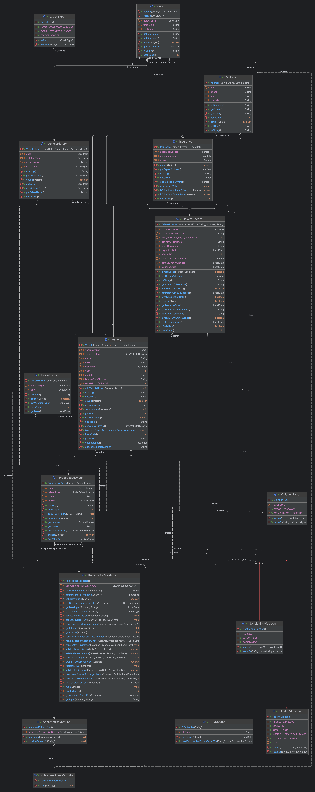
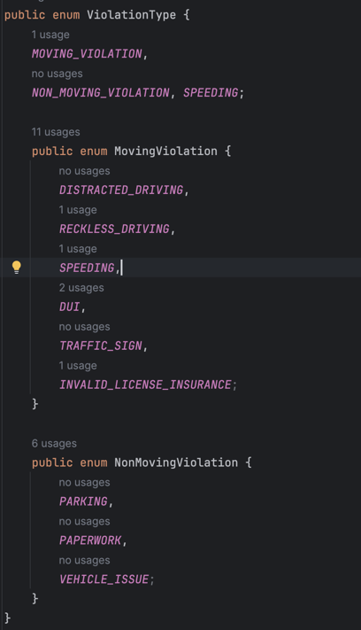
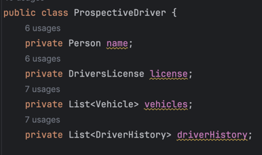
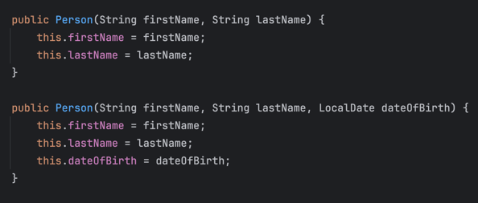

## Rideshare Driver Registration System

### Overview
This project aims to develop a software system for validating and registering prospective rideshare drivers. The system reads driver information from a CSV file, performs various checks and validations using the RegistrationValidator class, and maintains a pool of accepted drivers. The RegistrationValidator class is responsible for validating driver information, driver's license details, vehicle information, insurance details, and checking for any violations or crashes in the driver's or vehicle's history. Users can search for registered drivers by their last name and retrieve detailed information about them and their associated vehicles.

### Running the Program
1. Ensure that you have Java Development Kit (JDK) installed on your system.
2. To register a new prospective driver, run the RegistrationValidator class:
   - The program will display a menu with options to register a new prospective driver or exit.
   - Select option 1 to register a new prospective driver.
   - Follow the prompts to provide the required information about the driver, driver's license, vehicles, insurance, and any relevant history.
   - After completing the registration process, the program will display whether the registration was successful or rejected based on the validation rules.
   - You can register multiple prospective drivers by selecting option 1 again.
3. To view the list of accepted prospective drivers, run the RideshareDriverValidator class with the path to the CSV file containing prospective driver information as an argument.
4. Follow the prompts in the console to search for registered drivers by their last name or exit the program.

With these instructions, users can either register new prospective drivers using the RegistrationValidator class or view the list of accepted prospective drivers using the RideshareDriverValidator class.

### Key Challenges and Solutions
1. Handling CSV data: One of the main challenges was parsing the CSV data and mapping it to appropriate classes and objects. This was addressed by creating a dedicated CSVReader class that reads the CSV file line by line and creates objects for various entities like Person, Vehicle, Insurance, etc.
2. User input validation: Validating user input for different data types (e.g., dates, integers) and handling invalid inputs was a challenge. This was addressed by creating separate methods for input validation and providing error messages for invalid inputs.
3. Extensibility and maintainability: To ensure extensibility and maintainability, the project follows object-oriented principles like encapsulation, inheritance, and polymorphism. Additionally, design patterns like the Factory pattern and the Observer pattern were employed to enhance the code's flexibility and modularity.

### Resource Used
The following resources were consulted and used during the development of this project:
1. Oracle Java Documentation: https://docs.oracle.com/en/java/
2. Java Collections Framework: https://docs.oracle.com/javase/8/docs/technotes/guides/collections/index.html
3. Java Regular Expressions: https://docs.oracle.com/javase/tutorial/essential/regex/
4. Design Patterns in Java: https://sourcemaking.com/design_patterns
5. Stack Overflow: https://stackoverflow.com/

### UML Diagram
- 

### Questions About the Software System
1. Inheritance and Composition:
   - Inheritance: The ViolationType class has two subclasses, MovingViolation and NonMovingViolation, which inherit from the base class and provide specific types of violations.
    
   - 

   - Composition: The ProspectiveDriver class has a composition relationship with Vehicle and DriverHistory classes, where a driver can have multiple vehicles and driving violations.
    
   - 

2. Interface or Abstract Class:
   - The project does not use any abstract classes or interface.

3. Method Overriding and Overloading:
    - Method Overriding: The equals() and hashCode() methods are overridden in various classes like Person, Vehicle, and Insurance to provide custom equality and hashing behavior.

    - Method Overloading: The Person class has two overloaded constructors: one that takes only the first and last name, and another that takes the first name, last name, and date of birth.
    
    - 

4. Encapsulation:
    - All classes in the project follow the principle of encapsulation by providing private fields and public getter methods to access and modify the object's state.

5. Subtype Polymorphism:
    - Subtype polymorphism is demonstrated in RegistrationValidator class through the ViolationType class and its subclasses MovingViolation and NonMovingViolation. Instances of these subclasses can be assigned to variables of the base ViolationType class.
           
          ViolationType.MovingViolation movingViolation = ViolationType.MovingViolation.SPEEDING;
          ViolationType violationType = movingViolation;    

6. Generics:
    - Generics are not used in this project, as there was no specific need for generic data structures or methods.

7. Java Collections Framework:
    - The project uses various data collections from the Java Collections Framework, such as ArrayList, HashSet, and List.
    
          private List<Vehicle> vehicles;
          private List<DriverHistory> driverHistory;
          acceptedProspectiveDrivers = new HashSet<>();

8. Interfaces Iterable and Iterator:
    - The project does not explicitly use the Iterable and Iterator interfaces, as there was no specific need for custom iteration logic.

9. Interfaces Comparable and Comparator:
    - The project does not use the Comparable and Comparator interfaces, as there was no specific need for sorting or comparing objects.

10. Regular Expressions:
    - Regular expressions are used in the CSVReader class to split the CSV data lines into individual values based on the comma delimiter.
   
          String[] values = line.split(",");

11. Nested Classes:
    - The project does not utilize nested classes, as there was no specific need for them in the current design.

12. Functional Programming:
    - The project uses lambda expressions and streams in the AcceptedDriversPool class to filter and sort the list of accepted prospective drivers based on their last names.
           
          List<ProspectiveDriver> matchingProspectiveDrivers = acceptedProspectiveDrivers.stream()
          .filter(prospectiveDriver -> prospectiveDriver.getName().getLastName().equalsIgnoreCase(lastName))
          .sorted((d1, d2) -> d1.getName().getFirstName().compareTo(d2.getName().getFirstName()))
          .collect(Collectors.toList());
    
13. Design Patterns:
    - Factory Pattern: The RegistrationValidator class acts as a factory for creating instances of ProspectiveDriver and Vehicle objects based on user input.
    
          private static void registerDriver(Scanner scanner) {
          ProspectiveDriver newProspectiveDriver = new ProspectiveDriver(driverInfo, license);
          Vehicle vehicle = getVehicleInformation(scanner);
          newProspectiveDriver.addVehicle(vehicle);
          }
 
    - Observer Pattern: The AcceptedDriversPool class acts as an observer, maintaining a list of accepted prospective drivers and providing information about them when requested.
    
          public class AcceptedDriversPool {
              private Set<ProspectiveDriver> acceptedProspectiveDrivers;

              public AcceptedDriversPool() {
              acceptedProspectiveDrivers = new HashSet<>();
          }

          public void addDriver(ProspectiveDriver prospectiveDriver) {
              acceptedProspectiveDrivers.add(prospectiveDriver);
          }

14. MVC Architecture: 
    - The project follows a basic MVC (Model-View-Controller) architecture:
        - Model: Classes like Person, Vehicle, Insurance, and ProspectiveDriver represent the data models.
        - View: The console output acts as the view, displaying information to the user.
        - Controller: The RegistrationValidator and RideshareDriverValidator classes act as controllers, handling user input and coordinating the flow of the application.

15. Coupling:
    - Data Coupling: The Vehicle class is data-coupled with the Insurance class, as the Vehicle object holds an instance of the Insurance object.
      
          public class Vehicle {
             private Insurance insurance;

             public void setInsurance(Insurance insurance) {
                this.insurance = insurance;
             }
          }
          
    - Stamp Coupling: The ProspectiveDriver class is stamp-coupled with the Vehicle class, as the ProspectiveDriver object holds a collection of Vehicle objects.
    
          public class ProspectiveDriver {
              public List<Vehicle> getVehicles() {
                  return vehicles;
              }

              public void addVehicle(Vehicle vehicle) {
                  vehicles.add(vehicle);
              }
          }